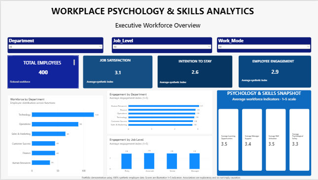
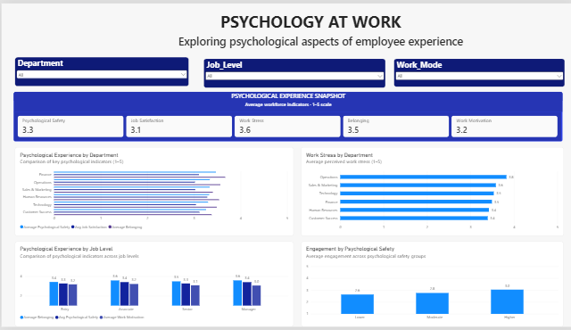
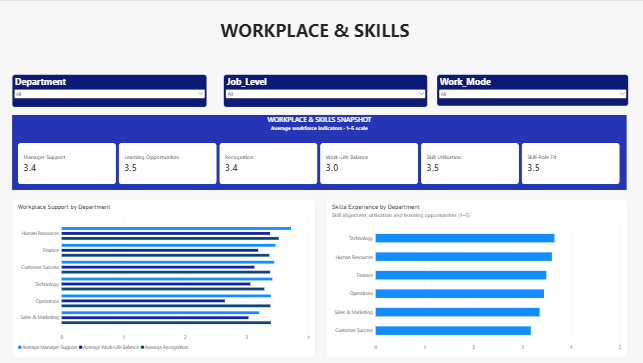
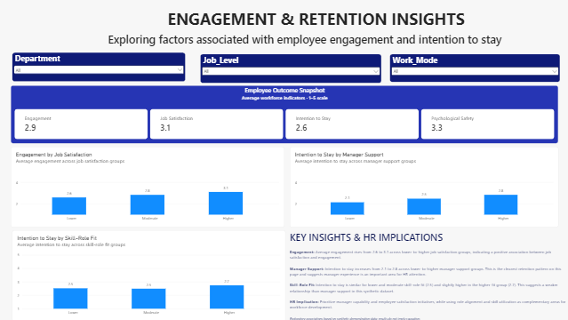

# Workplace Psychology & Skills Analytics

## Project Overview

This portfolio project explores how psychological, workplace, and skill-related factors are associated with employee engagement and intention to stay.

The project combines Industrial/Organizational Psychology concepts with People Analytics and Power BI to examine employee experience patterns and translate them into practical HR insights.

## Business Question

How are psychological, workplace, and skill-related factors associated with employee engagement and intention to stay?

## Dataset

The analysis uses a synthetic workforce dataset containing 400 fictional employee records.

The dataset includes:

- Employee demographics and workforce characteristics
- Psychological safety
- Job satisfaction
- Work motivation
- Belonging
- Work stress
- Manager support
- Recognition
- Work-life balance
- Skill-role fit
- Skill utilisation
- Learning opportunities
- Employee engagement
- Intention to stay

All employee data and scores used in this project are synthetic and were created solely for portfolio demonstration purposes.

## Tools

- Power BI
- Power Query
- DAX
- Excel
- People Analytics
- I/O Psychology

## Dashboard Structure

### 1. Executive Workforce Overview
Provides an overview of workforce composition, employee engagement, intention to stay, job satisfaction, and key workforce indicators.

### 2. Psychology at Work
Explores psychological safety, job satisfaction, work motivation, belonging, and work stress across the workforce.

### 3. Workplace & Skills
Examines manager support, recognition, work-life balance, skill-role fit, skill utilisation, and learning opportunities.

### 4. Engagement & Retention Insights
Explores associations between selected psychological, workplace, and skill-related factors and employee engagement and intention to stay.

## Key Insights

- Average engagement increased from 2.6 among employees in the lower job satisfaction group to 3.1 among those in the higher group.
- Average intention to stay increased from 2.1 in the lower manager support group to 2.8 in the higher manager support group.
- Skill-role fit showed a weaker retention pattern, with intention to stay at 2.5 for the lower and moderate groups and 2.7 for the higher group.
- Within this synthetic dataset, manager support showed a clearer relationship with intention to stay than skill-role fit.

## HR Implications

The exploratory findings highlight employee satisfaction and manager support as potentially important areas for employee experience and retention initiatives.

Role alignment, skill utilisation, and learning opportunities can complement these efforts as part of broader workforce development strategies.

## Methodological Note

This project is an exploratory portfolio analysis and does not establish causal relationships.

Lower, moderate, and higher analytical groups were created for demonstration and comparison purposes and should not be interpreted as validated psychometric thresholds.

All psychological and workplace scores are synthetic demonstration indicators rather than scores from validated psychological instruments.

## Data Privacy

This project uses 100% synthetic demonstration data.

It does not contain or represent confidential employee information, survey responses, internal data, proprietary methodologies, or findings from any current or former employer.
